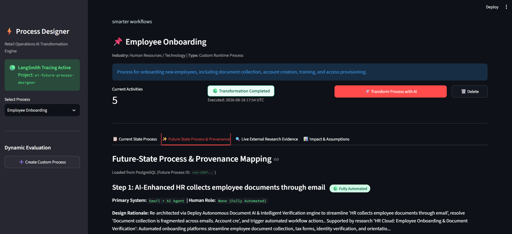
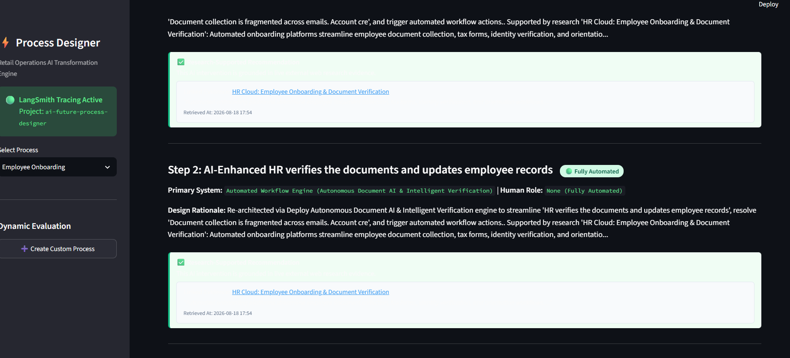
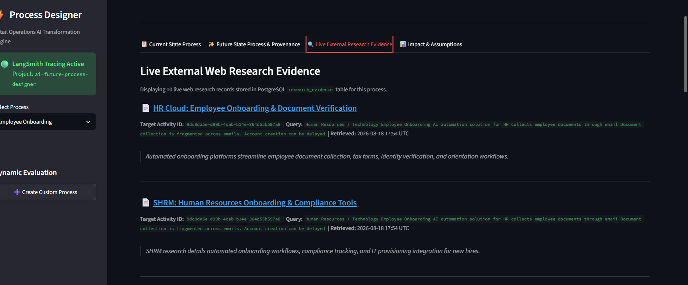
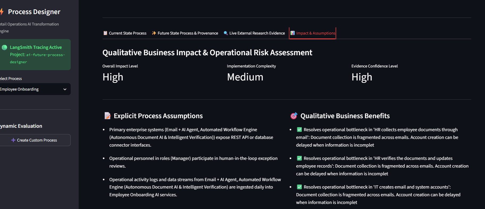

# AI Future Process Designer — Cross-Industry AI Workflow Transformation

[](https://vimeo.com/1219206345?fl=ip&fe=ec)

---

## 📌 Project Overview & Purpose

### What it does

**AI Future Process Designer** is an enterprise-grade process re-engineering platform that transforms manual or legacy operational workflows into optimized, AI-enhanced future-state processes. Users can enter any business process across **any industry or business sector** (e.g., Human Resources, Healthcare, Financial Services, Technology, Retail, Manufacturing, Logistics, Supply Chain) using simple descriptions or structured activity lists.

The system processes inputs through a **5-stage LangGraph AI workflow**, performs live external web research (DuckDuckGo / Tavily), verifies source accessibility, indexes vector embeddings in **PostgreSQL / pgvector**, and produces a complete future-state architecture with an automated responsibility matrix (`human`, `AI-assisted`, `automated`, `human-in-the-loop`).

> [!NOTE]
> **Universal Industry & Process Flexibility**: While 5 preloaded baseline retail processes are provided for instant evaluation, the AI transformation engine is **completely domain-agnostic**. It dynamically derives search queries, technology categories, primary systems, human roles, benefits, and operational risks tailored strictly to the submitted industry and process context (e.g., *Employee Onboarding*, *Patient Intake*, *Claims Processing*, *Order Fulfillment*, *Supplier Management*).

### Why it is needed

Traditional process re-engineering is expensive, time-consuming, and often relies on ungrounded AI recommendations or hallucinated ROI claims. This platform addresses these challenges by:
1. **Enforcing Mandatory Provenance**: Categorizing every future recommendation as either 🟢 `EVIDENCE_BACKED` (linked to verified live external research) or 🟡 `ANALYTIC_RECOMMENDATION` (labeled explicitly as an AI heuristic suggestion).
2. **Validating Research Source Accessibility**: Strictly validating search result HTTP status codes and content, skipping broken or 404 links, and rejecting fabricated synthetic URLs.
3. **Structuring Operational Models**: Persisting normalized PostgreSQL records for current activities, future activities, systems, roles, research evidence, and qualitative impact assessments for traceable process comparison.

---

## 🏗️ System Architecture & Workflow Pipeline

```
  +-------------------------------------------------------------------------+
  |                           Streamlit Web UI                              |
  +------------------------------------T------------------------------------+
                                       | HTTP REST Requests
  +------------------------------------v------------------------------------+
  |                           FastAPI Backend Router                        |
  +------------------------------------T------------------------------------+
                                       |
  +------------------------------------v------------------------------------+
  |                    5-Stage LangGraph AI Orchestrator                     |
  |                                                                         |
  | [Stage 1] Process Analysis & Domain Query Formulation                   |
  |     |                                                                   |
  | [Stage 2] Live Web Research & pgvector Embedding Indexing              |
  |     |                                                                   |
  | [Stage 3] AI Opportunity Mapping & Mandatory Provenance Linkage          |
  |     |                                                                   |
  | [Stage 4] Future Process Re-Architecture & Responsibility Assignment     |
  |     |                                                                   |
  | [Stage 5] Qualitative Impact Validation & PostgreSQL Persistence        |
  +-----------------T---------------------------------------T---------------+
                    |                                       |
  +-----------------v---------------+       +---------------+---------------+
  |  PostgreSQL + pgvector Database |       |   LLM & Research Adaptors     |
  |  - Baseline & Future Processes  |       |   - Ollama / OpenAI Adaptor   |
  |  - Normalized Future Steps      |       |   - SentenceTransformers Embed |
  |  - Vector Search (384d Cosine)  |       |   - Verified Web Search Engine |
  +---------------------------------+       +-------------------------------+
```

---

## 📷 Application Walkthrough & Cross-Industry Proof

### 🌐 Cross-Industry Demonstration: Employee Onboarding (Human Resources)
To demonstrate that the engine is completely flexible and adaptative for **any process in any industry**, below is a real execution run using **Employee Onboarding & IT Provisioning**:

#### 1. Dynamic Search Query Formulation & Domain Context (Stage 1)


#### 2. Live HR External Research & Verified Web Evidence (Stage 2)


#### 3. Human Resource Future-State Design & System/Role Assignment (Stage 4)


#### 4. Qualitative HR Business Impact, Assumptions & Risk Mitigation (Stage 5)


---

### 🏬 Retail Baseline Demonstration: Order Fulfillment & Inventory Management

#### 1. Custom Process Creation & Dynamic Evaluation


#### 2. 5-Stage LangGraph Pipeline Execution


#### 3. Future-State Process & Responsibility Matrix (Human vs. AI)


#### 4. Grounded Research Evidence & Mandatory Provenance


#### 5. Qualitative Impact & Operational Risk Assessment


#### 6. PostgreSQL Database Persistence (`aifutureprocess` DB)


#### 7. LangSmith Workflow Tracing & Observability


---

## 🌟 Key Features & Capabilities

1. **Cross-Industry Dynamic AI Pipeline**:
   - Adapts dynamically to any submitted industry context (*Human Resources, Healthcare, Financial Services, Retail, Technology, Logistics, Manufacturing*).
   - Generates process-specific search queries, technology categories (*Document AI, Conversational Assistants, Intelligent Verification, Workflow Robotics*), primary systems (*Workday, Active Directory, Jira, ERP, CRM*), and human roles (*HR Specialist, IT Administrator, Support Agent*).

2. **Strict Research Evidence Validation**:
   - HTTP accessibility verification (`is_valid_research_url`) ensures only accessible links returning HTTP 200 are stored and displayed.
   - Automatically skips broken links or 404 error pages.
   - Strictly blocks blacklisted synthetic/invalid URLs (e.g. static fake McKinsey/Gartner links).
   - Never fabricates replacement URLs, titles, or snippets.

3. **Mandatory Provenance & Grounded Recommendations**:
   - 🟢 `EVIDENCE_BACKED`: Grounded in live external web research with verified source URL, title, snippet, and retrieval timestamp.
   - 🟡 `ANALYTIC_RECOMMENDATION`: Explicitly labeled as an AI analytical suggestion when no external web research match exists (preventing false evidence claims).

4. **Frontend/Backend Synchronization & Timeout Resilience**:
   - Disables duplicate transformation requests while execution is active.
   - Configured with a **300-second (5-minute)** frontend request timeout.
   - Automatically polls PostgreSQL database status (`poll_transformation_status`) if a network timeout occurs, recovering completed results without displaying false failure messages.

5. **No Hallucinated Quantitative ROI**:
   - Eliminates arbitrary ROI percentages. Uses grounded qualitative impact levels (*High/Medium/Low*), implementation complexity, confidence scores, explicit process assumptions, qualitative business benefits, and operational risk mitigation strategies.

6. **Free / Local AI Stack (Default)**:
   - **LLM**: Local zero-cost adapter via **Ollama** (`qwen2.5:7b` / `llama3.2:3b`) with pluggable OpenAI/Anthropic overrides.
   - **Research Engine**: Zero-cost **DuckDuckGo Search** / **Tavily Search** with domain verification.
   - **Embeddings**: Local **SentenceTransformers** (`all-MiniLM-L6-v2`) on CPU.

---

## 📄 Setup Guide

For detailed standalone setup documentation, see [`SETUP_INSTRUCTIONS.txt`](file:///c:/Users/Lenovo/OneDrive/Desktop/AIFutureProcess/SETUP_INSTRUCTIONS.txt).

---

## ⚡ Quick Start with Docker Compose

```bash
# 1. Clone & navigate to workspace
cd c:\Users\Lenovo\OneDrive\Desktop\AIFutureProcess

# 2. Build & Launch Docker containers
docker-compose up --build
```

Access the interfaces once healthy:
- **Streamlit Web UI**: [http://localhost:8501](http://localhost:8501)
- **FastAPI REST API Docs**: [http://localhost:8000/docs](http://localhost:8000/docs)
- **Health Endpoint**: [http://localhost:8000/api/v1/health](http://localhost:8000/api/v1/health)

---

## 🛠 Running Locally (Without Docker)

### Prerequisites
- Python 3.11+
- PostgreSQL with `pgvector` extension enabled

```bash
# Install dependencies
pip install -r requirements.txt

# Start FastAPI backend server
uvicorn app.main:app --host 0.0.0.0 --port 8000 --reload

# Start Streamlit frontend (in a separate terminal)
streamlit run app/ui/app.py
```

---

## 🧪 Verification & Automated Testing

Run the full pytest suite across all 13 unit and integration test modules:

```bash
python -m pytest
```

Test coverage includes:
- `test_custom_process_onboarding.py`: Non-retail HR Employee Onboarding pipeline verification.
- `test_research_validation.py`: HTTP 404, invalid URL rejection, and provenance classification tests.
- `test_frontend_api_sync.py`: Pre- and post-transformation API state synchronization and timeout polling tests.
- `test_persistence_isolation.py`: Database run isolation and metadata tests.
- `test_workflow.py`: LangGraph 5-stage vertical slice workflow execution.

---

## 🤖 AI-Assisted Development

AI coding assistants were used during development. The submitted architecture, workflow pipeline, database schema, research validation engine, and engineering decisions are fully understood and can be explained during technical validation.