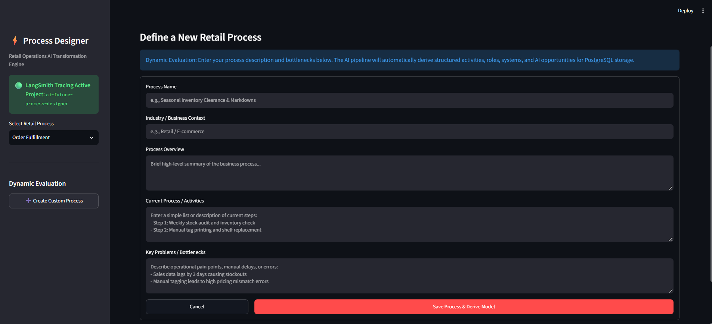
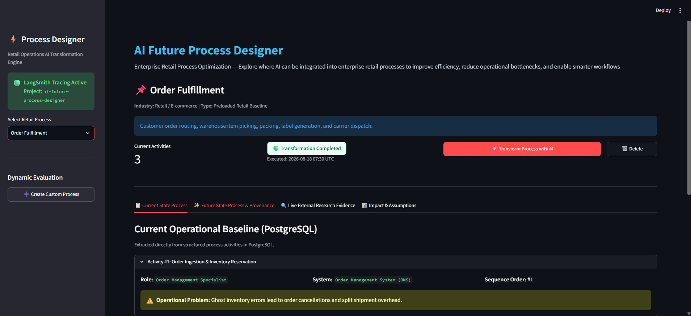
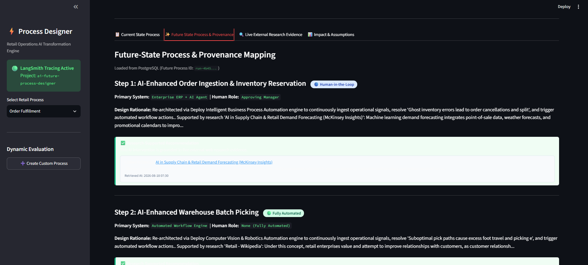
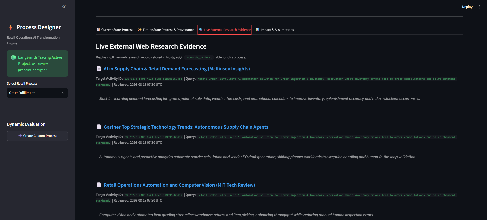
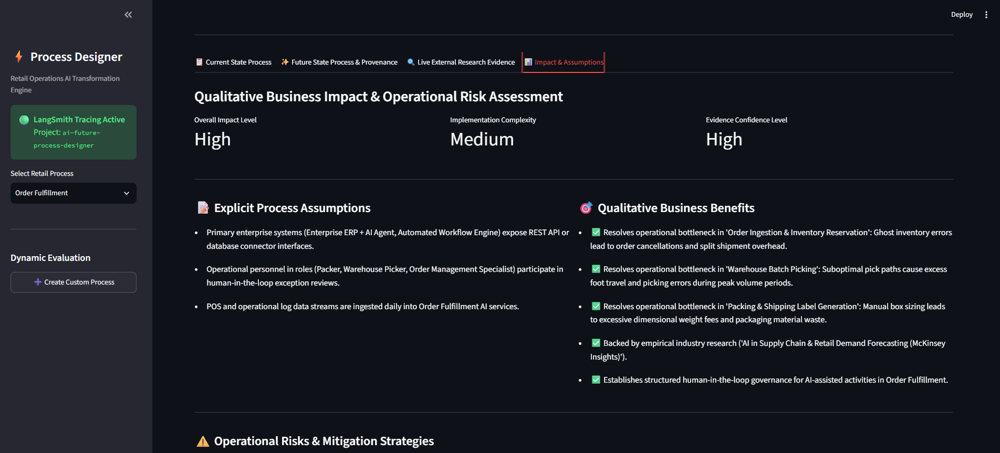
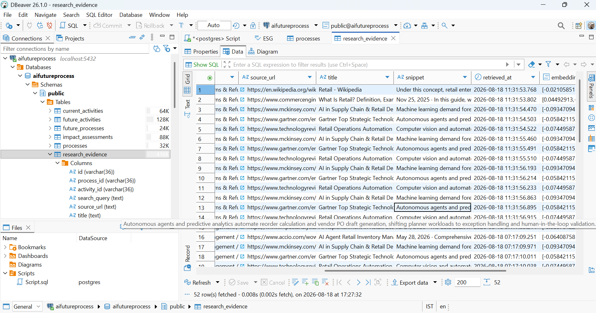
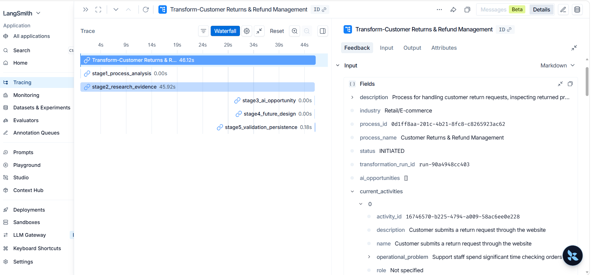

# AI Future Process Designer for Retail Operations

[](https://vimeo.com/1219206345?fl=ip&fe=ec)

---

## 📌 Project Overview & Purpose

**What it does:**  
AI Future Process Designer takes manual or legacy retail operational workflows entered as high-level process information and free-text descriptions, automatically converting them into structured process activities before transforming them into an optimized future-state design using a 5-stage LangGraph AI agent workflow,live web research evidence, and human/AI responsibility mapping.

**Why it is needed:**  
Traditional business process re-engineering is time-consuming, costly, and frequently plagued by ungrounded AI hallucinations or static ROI claims. This system solves these challenges by enforcing mandatory evidence provenance (classifying recommendations as `EVIDENCE_BACKED` vs `ANALYTIC_RECOMMENDATION`), indexing research snippets using vector embeddings in PostgreSQL/pgvector, and clearly defining execution boundaries (`human`, `AI-assisted`, `automated`, `human-in-the-loop`) to enable evidence-grounded operational decisions.

---

## 🎥 Demo Video

▶️ **Watch the Full Video Walkthrough**: [https://vimeo.com/1219206345?fl=ip&fe=ec](https://vimeo.com/1219206345?fl=ip&fe=ec)

---

## 🏗️ System Architecture & Workflow Pipeline

```
  +-------------------------------------------------------------------------+
  |                           Streamlit Web UI                              |
  +------------------------------------T------------------------------------+
                                       | HTTP REST Requests
  +------------------------------------v------------------------------------+
  |                           FastAPI Backend Router                        |
  +------------------------------------T------------------------------------+
                                       |
  +------------------------------------v------------------------------------+
  |                    5-Stage LangGraph AI Orchestrator                     |
  |                                                                         |
  | [Stage 1] Process Analysis & Bottleneck Identification                   |
  |     |                                                                   |
  | [Stage 2] Live Web Research (DuckDuckGo/Tavily) & Vector Embeddings     |
  |     |                                                                   |
  | [Stage 3] AI Opportunity Mapping & Mandatory Provenance Linkage          |
  |     |                                                                   |
  | [Stage 4] Future Process Re-Architecture & Responsibility Assignment     |
  |     |                                                                   |
  | [Stage 5] Qualitative Impact Validation & Database Persistence         |
  +-----------------T---------------------------------------T---------------+
                    |                                       |
  +-----------------v---------------+       +---------------+---------------+
  |  PostgreSQL + pgvector Database |       |   LLM & Research Adaptors     |
  |  - Baseline & Future Processes  |       |   - Ollama / OpenAI Adaptor   |
  |  - Structured Future Steps      |       |   - SentenceTransformers Embed |
  |  - Vector Search (384d Cosine)  |       |   - DuckDuckGo / Tavily Web   |
  +---------------------------------+       +-------------------------------+
```

---

## 📷 Screenshots & Application Walkthrough

### 1. Dynamic Evaluation & Custom Process Creation


### 2. 5-Stage LangGraph Pipeline Execution


### 3. Future-State Process & Responsibility Mapping (Human vs. AI)


### 4. Grounded Research Evidence & Mandatory Provenance


### 5. Business Impact & Risk Assessment


### 6. PostgreSQL Database Persistence (`aifutureprocess` DB)


### 7. LangSmith Workflow Tracing & Observability


---

## 🌟 Key Features

1. **5-Stage LangGraph AI Orchestration**:
   - `Process Analysis` → `Research & Evidence` → `AI Opportunity Analysis` → `Future Process Design` → `Validation & Persistence`.
2. **Free / Local AI Stack (Default)**:
   - **LLM**: Local zero-cost adapter via **Ollama** (`qwen2.5:7b` / `llama3.2:3b`) with pluggable OpenAI/Anthropic overrides.
   - **Research**: Zero-cost **DuckDuckGo Search** (no API key required) with pluggable Tavily search fallback.
   - **Embeddings**: Local **SentenceTransformers** (`all-MiniLM-L6-v2`) on CPU.
3. **Mandatory Evidence Provenance**:
   - Every recommendation is classified and displayed as:
     - 🟢 `EVIDENCE_BACKED`: Grounded in live external web research with source URL, title, snippet, and retrieval timestamp.
     - 🟡 `ANALYTIC_RECOMMENDATION`: Labeled explicitly as an AI analytical suggestion (never falsely represented as external empirical evidence).
4. **No Unsupported Quantitative Claims**:
   - Eliminates arbitrary hallucinated ROI percentages. Uses grounded qualitative impact levels (`High`/`Medium`/`Low`), implementation complexity, confidence scores, explicit process assumptions, qualitative benefits, and operational risks.
5. **Dynamic Runtime Custom Process Support**:
   - Evaluators can enter any completely new retail process at runtime without hardcoded process-specific branching.
6. **5 Preloaded Retail Operations Processes**:
   - Inventory Management / Replenishment (**Primary Demo Process**)
   - Order Fulfillment
   - Customer Service
   - Supplier Management
   - Returns Management

**Structured CURRENT → TRANSITION → FUTURE Model**:
Current activities, future activities, AI interventions, roles, systems, decisions, evidence relationships, impact assessments, and provenance are persisted as normalized PostgreSQL records rather than generated as unstructured paragraphs. Future activities maintain a reference to their corresponding current activities, enabling traceable process comparison.

---

## 📄 Evaluator Setup Guide

For a standalone plain text guide that evaluators can view or print, see [`SETUP_INSTRUCTIONS.txt`](file:///c:/Users/Lenovo/OneDrive/Desktop/AIFutureProcess/SETUP_INSTRUCTIONS.txt).

---

## ⚡ Quick Start with Docker Compose

```bash
# 1. Clone & navigate to workspace
cd c:\Users\Lenovo\OneDrive\Desktop\AIFutureProcess

# 2. Build & Launch Docker containers
docker-compose up --build
```

Access the interfaces once healthy:
- **Streamlit Web UI**: [http://localhost:8501](http://localhost:8501)
- **FastAPI REST API Docs**: [http://localhost:8000/docs](http://localhost:8000/docs)
- **Health Endpoint**: [http://localhost:8000/api/v1/health](http://localhost:8000/api/v1/health)

---

## 🛠 Running Locally (Without Docker)

### Prerequisites
- Python 3.11+
- PostgreSQL with `pgvector` extension enabled

```bash
# Install dependencies
pip install -r requirements.txt

# Start FastAPI backend server
uvicorn app.main:app --host 0.0.0.0 --port 8000 --reload

# Start Streamlit frontend (in a separate terminal)
streamlit run app/ui/app.py
```

---

## 🧪 Verification & Testing

Run unit & integration tests using pytest:

```bash
python -m pytest
```

## 🤖 AI-Assisted Development

AI coding assistants were used during development. The submitted implementation, architecture, workflow, database design, and major engineering decisions are understood and can be explained during technical validation.